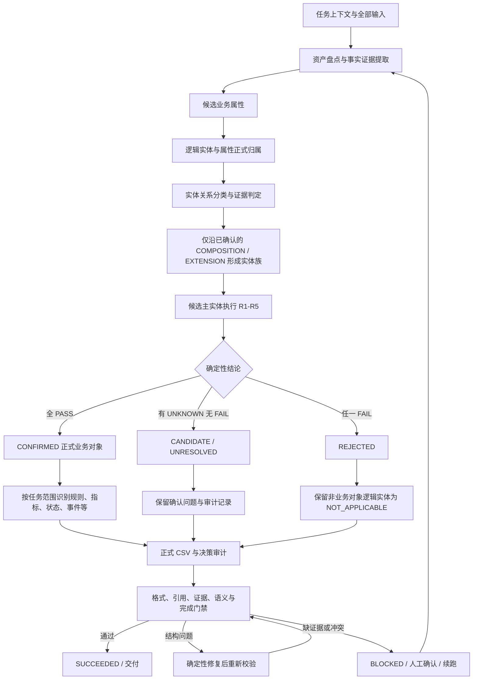

# 本体建模识别过程 SOP

## 1. 文档目的

本文档描述本体建模中“业务对象与逻辑实体识别”过程的完整执行路径：从任务启动、输入资产盘点、证据勘察，到逻辑实体/业务对象判定、正式 CSV 输出与门禁校验的全流程标准。

适用于 47313 工作台与 47314 独立建模服务的全部建模任务（数据库、上传文件、文档等输入源），不区分行业、产品或具体场景。核心原则：先盘点、再识别；先证据、后结论；结论强度不能超过证据强度；只交付任务明确要求的产物。

---

## 2. 核心原则

识别过程的底层约束，任何步骤都不得违反。

- **分层原则**：必须按 `数据源资产 → 物理对象 → 候选业务属性 → 逻辑实体 → 业务属性归属 → 实体关系 → 关系分类 → 实体族 → 候选主实体 → 业务对象判定 → 业务对象目录` 顺序执行，禁止跳过逻辑实体层直接从物理表识别业务对象。
- **全量覆盖原则**：每个输入资产必须进入“已识别逻辑实体 / 明确排除的技术或派生资产 / 待确认资产”至少一类，不得无解释遗漏。
- **业务对象与逻辑实体分离原则**：“不是业务对象”不等于“不是逻辑实体”。从属实体、关系实体、参考实体、观测实体、文档内容实体和派生实体均可作为逻辑实体存在，但通常不独立构成业务对象。
- **证据优先原则**：任何结论必须由可追溯证据支持；证据不足时输出 `UNKNOWN`/`UNRESOLVED` 或待确认，不得臆造字段、流程、状态、Owner 或生命周期。
- **强反证优先原则**：正向证据与反向证据冲突时，强反证优先于弱正向证据（独立身份优先于名称相似，独立生命周期优先于外键连接，独立管理优先于同系统/同模块）。
- **配置与核心规范分离原则**：行业术语、表名/字段名、系统前缀、英文后缀、固定业务词典、固定分值/权重不写死在通用规范中，由项目配置加载。
- **事实证据门禁原则**：一致性校验只能发现缺口，不能创造事实。校验器是只读语义检查器，其返回的缺失关系、ERROR/WARNING、重试次数和“校验未通过”均不得直接新增实体、属性、关系、业务对象或规则；结构性修复（CSV 表头、编码、格式）与语义修复（新增或改变业务语义）必须分离，后者必须有新证据。

---

## 3. 全景主流程



主流程中的原始事实、决策中间态和正式交付必须分开保存。正式 CSV 不能反过来作为本轮识别证据，中间候选也不能因为模板要求非空而被自动升级为正式事实。

### 第一步：任务启动与意图识别

- 创建 run：确认输入源模式（`DATABASE` / 上传文件 / `DOCUMENT`）、建模要求（`prompt`）、需要产出的结果文件（`requestedArtifacts`，未指定时用默认集合，未知文件名直接 `422`）。
- 数据库建模：选择服务端已配置的数据源（前端不接触 Host/用户名/密码），按 Schema 多选、数据表多选；服务端用只读账号连接并设置 `search_path`。
- 意图识别：先判断本回合是“建模执行指令”还是“普通咨询/问答”。
  - 执行指令优先：`继续/接着…做/执行/跑/生成/处理/修复/修改/建模/完成/导出/识别`、`重新…`、`请/帮我/麻烦你…（继续/重新/直接/生成/修改/…）` 等明确执行语义 → 按建模执行回合处理。
  - 疑问词判定仅在未命中执行指令时生效；`为什么失败、怎么建模、帮我看看、先说说项目` 等纯咨询保持问答。
  - 问答回合不启动建模、不触发 finalize 门禁，完成后恢复到问答前的状态（`INPUT_READY`/`FAILED`/`BLOCKED`），`BLOCKED` 问完问题保留暂停原因。
- 工作区：每个 run 只有 `input/`、`work/`、`output/` 三个真实目录，建模引擎内部的 `mission-input`/`mission-work`/`mission-output` 是同一工作区的安全别名。

### 第二步：输入资产盘点

- 把不同数据源转换为统一输入模型（`Asset`、`Attribute`、`IdentityConstraint`、`Relationship`、`Cardinality`、`InstanceEvidence`、`LifecycleEvidence`、`GovernanceEvidence`、`SemanticEvidence`、`LineageEvidence`）。
- 物理对象先分类：业务数据资产、参考数据资产、观测/事件资产、文档资产、派生分析资产、系统技术资产、未分类资产。此阶段不直接识别业务对象。
- 资产覆盖校验：输入资产总数 = 已映射资产数 + 明确排除数 + 待确认数，必须闭环。

### 第三步：证据勘察与读取

- 数据库：必须先执行 `mission-input/extract_schema.py`，把选中表结构提取到 `work/schema_extract.json`，并基于该文件建模；缺少表结构证据时禁止使用模板样例数据生成正式输出（服务端报 `DATABASE_SCHEMA_EVIDENCE_MISSING` 结构性阻断）。
  - `schema_extract.json` 首部是 `tableNames` 表名清单：先读清单获得全部表名，再按表名/列名用 `grep` 定向查询单表定义，禁止反复整文件读取；模板与规范 CSV 只读取一次理解结构。
  - 只读问题（如表数量）服务端直接回答，不误启动建模。
- 上传文件：输入只来自当前 run 的 `mission-input/`；含样例数据模板（如 `*含样例数据*/02-*.csv`）仅用于理解字段、编码和页面显示填写示例，不是真实输入，不得把样例行复制到结果或据此新增建模对象。
- 文档：先读 `manifest.json`，再完整读取 `content.md`、全部章节/页与全部表格 CSV；证据引用必须带文档名与章节或页码，禁止只读摘要、第一页或前几行。
- 术语/规则/指标专项：按任务解析要素采集显式约束、代码/配置规则、实际 SQL/BI 口径，推导项必须有来源证据并标为待确认，不得覆盖人工语义资产或补造公式。

### 第四步：候选业务属性识别

- 把本次输入识别到的全部源属性写入 `modeling_state.json` 的 `allAttributes`（服务端落盘为 `mission-work/all_attributes.csv`），必须保留业务字段、技术字段、物理主键、外键、审计字段和派生字段；技术字段不得因不进入正式输出而从分析中删除。
- 每个候选属性记录：来源物理对象/字段、原始名称、数据类型、可空性、主键/唯一/引用约束、样例值、枚举、字段描述、初步业务含义、初步属性角色、证据等级。
- 属性角色（主角色且只能一个）：`IDENTIFIER` / `DESCRIPTIVE` / `CLASSIFICATION` / `STATUS` / `TEMPORAL` / `MEASURE` / `REFERENCE` / `LOCATION` / `PARTY` / `DOCUMENT` / `AUDIT` / `TECHNICAL` / `DERIVED` / `UNCLASSIFIED`。
- 默认不识别为业务属性的字段：数据库存储地址、无业务意义的分区键、缓存键、同步游标、消息偏移量、系统运行标志、技术校验值、内部序列号、临时处理状态、纯展示格式字段。若技术字段同时承担稳定业务身份或治理用途，不得仅因其技术实现形式排除。

### 第五步：逻辑实体识别

- 生成条件（满足至少一项）：表示可区分的一类实例、具有稳定属性集合、具有可识别身份、在业务/数据/流程中被单独引用、在契约或接口中作为独立资源、在文档或事件中形成稳定语义单元。
- 合并条件（全部满足才合并）：表达同一业务概念、身份一致、生命周期一致、治理责任一致、不存在独立管理边界、差异仅来自物理拆分/分区/存储层级/技术实现。
- 拆分条件（出现任一情况即拆）：包含多个独立身份体系、多个独立生命周期、混合多个可独立管理概念、存在重复组或嵌套对象、不同字段组 Owner 不同、不同字段组可独立创建/修改/消费。
- 实体角色（主角色且只能一个）：`CANDIDATE_MAIN_ENTITY` / `DEPENDENT_ENTITY` / `RELATIONSHIP_ENTITY` / `MASTER_DATA_ENTITY` / `REFERENCE_DATA_ENTITY` / `OBSERVATION_EVENT_ENTITY` / `DOCUMENT_CONTENT_ENTITY` / `DERIVED_ANALYTICAL_ENTITY` / `SYSTEM_TECHNICAL_ENTITY` / `UNCLASSIFIED_ENTITY`。
- 属性簇是实体边界的证据（共同身份/生命周期/业务含义/治理责任/创建维护行为/消费场景），但不能单独替代实体独立性判断。

### 第六步：业务属性正式归属

- 候选属性在逻辑实体初步形成后正式归属，并根据归属结果重新检查实体是否需要合并/拆分；属性不得在未确认实体归属前直接成为最终业务属性。
- 归属后标准化：业务语言命名、明确业务定义、统一数据类型语义/单位精度/枚举含义、识别同义与一词多义、区分原始与派生、保留物理字段映射、记录转换计算规则。标准化不得修改源数据事实。
- 覆盖校验：每个非技术业务字段必须映射为业务属性或明确说明排除原因；每个业务属性必须归属一个逻辑实体；标识/引用/状态/派生属性分别满足证据与追溯要求。
- 正式 `business_attributes.csv` 只是 `allAttributes` 经过证据和业务语义过滤后的子集；属性名称唯一范围是“逻辑实体编码 + 业务属性名称”，跨实体同名且语义明显不同只记 WARNING，禁止为通过校验自动加前缀或改名。

### 第七步：实体关系识别与分类

- 关系类型：`COMPOSITION`（组成，子实体身份或生命周期依赖父实体，可聚合）、`EXTENSION`（同一概念属性扩展，可聚合）、`ASSOCIATION`（独立实体业务关联）、`REFERENCE`（引用身份/属性）、`TRANSFORMATION`（来源/转换/履约/结算/派生）、`OBSERVATION_OF`（事件/日志/测量/观测）、`SPECIALIZATION`（泛化/特化，默认不作组成）、`UNKNOWN`（证据不足）。
- 判定决策树顺序：同一身份/生命周期/治理责任 → `EXTENSION`；一端依赖另一端身份且无法独立管理 → `COMPOSITION`；两端均可独立存在且关系表达业务关联 → `ASSOCIATION`；一端仅保存另一端身份/属性引用 → `REFERENCE`；一端由另一端转换/产生/履约/派生 → `TRANSFORMATION`；一端记录对另一端的事件/测量/日志/观测 → `OBSERVATION_OF`；明确父类—子类语义 → `SPECIALIZATION`；否则 `UNKNOWN`。
- 名称相似、同系统/同模块/同前缀、普通外键均不足以单独确定关系类型；`COMPOSITION` 方向契约固定为 `source=component/dependent/child → target=owner/parent`。
- `M:N` 关系必须拆分为两个 `1:N` + 中间关系实体；每条关系必须记录源/目标实体、类型、基数、关联属性、三类证据、是否参与聚合、置信度、冲突证据。
- 关系决策状态只允许 `CONFIRMED` / `CANDIDATE` / `UNRESOLVED` / `REJECTED`：正式实体关系只输出 `CONFIRMED` 且有可追溯证据的关系；`CANDIDATE`/`UNRESOLVED`/`REJECTED` 只保留在候选/审计/待确认中。

### 第八步：实体族、候选主实体与业务对象判定

- 实体族：以逻辑实体为节点，只保留已确认且通过语义校验的 `COMPOSITION`/`EXTENSION` 边求连通分量；每个实体族必须且只能有一个候选主实体；无主、多主、Owner 冲突、方向错误或 `COMPOSITION` 循环的实体族不得进入正式业务对象。完整 ER 连通图不得直接作为实体族。
- 候选主实体来源：`CANDIDATE_MAIN_ENTITY`、`MASTER_DATA_ENTITY`、有独立管理价值的 `OBSERVATION_EVENT_ENTITY`、有独立治理价值的 `DOCUMENT_CONTENT_ENTITY`、有独立身份和生命周期的 `RELATIONSHIP_ENTITY`。
- R1–R5 判定（每条只能输出 `PASS`/`FAIL`/`UNKNOWN`）：

| 规则 | 判定内容 | PASS 要点 | FAIL 要点 |
| --- | --- | --- | --- |
| R1 业务意义与治理责任 | 是否为目标业务范围内的重要概念，有业务用途、治理主体、责任域或权威来源 | 直接业务和治理证据充分 | 明确仅为技术或冗余产物 |
| R2 稳定身份 | 实例能否稳定区分、引用、交换和追踪 | 身份稳定且可追踪（允许单字段/复合/自然/代理/外部标识） | 明确不存在独立身份 |
| R3 独立性 | 能否脱离其他对象独立理解、创建、管理、查询、消费 | 独立性明确 | 明确依赖父对象 |
| R4 生命周期 | 是否存在产生、变化、失效、终止或永久留存机制 | 生命周期明确（不可变事件也可有“发生并留存”生命周期） | 明确无生命周期，仅为静态有限值或纯派生结果 |
| R5 可实例化 | 能否产生多个可区分实例，由业务/操作/事件/治理活动产生 | 可形成业务实例集合 | 仅为固定值域、纯技术配置或纯计算结果 |

- 结论：R1–R5 全部 `PASS` → `CONFIRMED`；无 `FAIL` 且至少一个 `UNKNOWN` → `CANDIDATE`；任一 `FAIL` → `REJECTED`。置信度不改变结论，只描述证据可靠性。
- 正式 `business_objects.csv` 只收录 `CONFIRMED`；`CANDIDATE`/`REJECTED` 只进决策审计，不得丢弃，也不能因此删除对应逻辑实体。
- 非业务对象判定（R5 应用）：基础数据（分类/标签型参考数据）、规则数据（规则配置项/表达式/执行结果）、参考数据、报告报表数据（报表模板/查询定义/统计展示等纯派生展示）不得识别为业务对象；例外保留可独立创建/版本化/审批/发布/生效/停用/审计的规则定义或规则版本、有唯一报告编号和独立生命周期的报告实例、可治理的主数据。
- 判定必须基于证据组合（实例来源、数量是否可预置、稳定身份、独立治理、业务行为、生命周期、是否纯派生展示），不得仅凭名称、表名或数据类别一刀切；名称出现“字典、类型、规则、报表、报告、统计”等词只触发复核并生成具体确认问题。
- 逻辑实体归属状态（服务端门禁校验）：
  - `ASSIGNED`：业务对象编码/名称必填，必须引用本次 `CONFIRMED` 业务对象，每个业务对象有且只有一个主逻辑实体（主标志 `Y`）；
  - `NOT_APPLICABLE`：非业务对象逻辑实体，编码/名称必须留空、主标志 `N`，必须带非业务对象分类/排除原因/证据，并关联对应 `REJECTED` 候选决策；禁止创建 `BO0000`、`BO99999`、`非业务对象逻辑实体` 等占位业务对象；
  - `UNRESOLVED`：证据不足，编码/名称为空、主标志 `N`，必须保留确认问题，不得伪装成 `NOT_APPLICABLE`；空编码且无审计状态是结构错误，绝不自动推断。

### 第九步：正式 CSV 输出与决策审计

- 只生成 `requestedArtifacts`/`execution-context.expectedFiles` 明确选中的 CSV；文件名、第一行表头、字段顺序严格沿用本体元模型模板 v0.0.1，UTF-8 编码，布尔统一 `Y/N`，空值留空（不写 `None`/`undefined`/`********`），多值用 JSON 数组字符串。
- 编码规范：业务对象/逻辑实体/业务属性编码 `^[A-Za-z][A-Za-z0-9_]*$`；业务规则编码 `R` + 7 位流水码（如 `R0000001`）；状态/事件无来源编码时标记待确认，禁止自定前缀。
- 每个 `CONFIRMED` 业务对象的逻辑实体中必须且只能有一个 `是否主逻辑实体=Y`；`业务对象编码` 为空时主标志必须为 `N`。`是否唯一` 表示业务上的唯一标识；复合业务唯一标识不得拆成多个单字段唯一。`是否层级编码`/`是否层级名称` 当前未实现维度输出，统一填 `N`。
- 决策审计：每个参与判定的业务对象候选保留结构化决策（R1–R5 各自 PASS/FAIL/UNKNOWN、证据与来源、冲突、未知原因、确认问题、建议确认角色、置信度），写入 `modeling_state.json` 的 `businessObjectDecisions`，并稳定导出为 `work/business_object_decisions.csv`；最终决策由代码按 R1–R5 重算，正式输出与决策审计必须通过编码一致性校验。
- 服务端落盘审计文件（`work/`）：`business_object_decisions.csv`、`relation_decisions.csv`、`rule_decisions.csv`、`indicator_decisions.csv`、`logical_entity_decisions.csv`、`all_attributes.csv`、`validation_report.json`、`modeling_state.json`。中间态和审计不写入 `output/`。

### 第十步：门禁校验、状态流转与交付

- 十个校验阶段（按请求产物范围激活，已通过阶段按内容签名缓存复用）：输入契约 → 数据资产盘点 → 全量属性 → 主键与外键 → 术语 → 逻辑实体 → 业务属性 → 实体关系 → 业务对象 → 规则指标与最终输出。
- 校验前先做确定性规范化（服务端自动修复，幂等且审计留痕）：未决输入资产补 `UNKNOWN`、弱 `COMPOSITION` 降级 `REFERENCE`、无证据 `UNKNOWN→CONFIRMED` 升级拒绝、非法 `CONFIRMED` 降级 `CANDIDATE`、`NOT_APPLICABLE` 主标志/编码清洗、证据循环清理、技术字段从正式输出排除等。
- 门禁动作分级：
  - `STRUCTURAL_BLOCKER`：确定性格式/契约错误、证据缺失等结构性阻断，只有它能失败阶段并进入 Agent 修复循环；
  - `DETERMINISTIC_NORMALIZATION`：服务端可自动修复的缺口；
  - `FORMAL_ELIGIBILITY`：`CANDIDATE`/`UNRESOLVED`/`REJECTED` 行出现在正式 CSV 等不合资格项，降级处理；
  - `QUALITY_WARNING`：语义质量提示，不阻断。
- 修复预算：只有 `STRUCTURAL_BLOCKER` 消耗修复预算，默认上限 10 次；相同错误无新证据立即 `BLOCKED`。修复期间必须先检查是否有同一 `tool_call_id` 的真实结果复用，写工具不得因 retry/continue 二次执行。
- 状态流转：

```text
CREATED/INPUT_READY → QUEUED → CLAIMED → ANALYZING → VALIDATING → SUCCEEDED
                         │          └────→ CANCELLING → CANCELLED
                         └──────────────────────────────────────────────→ FAILED
```

  - 建模执行中被门禁/安全阀暂停 → `BLOCKED`（保留 checkpoint，暂停原因可折叠展示，可继续运行或提问）；结构性校验失败 → `FAILED`；`FAILED`/`BLOCKED`/`CANCELLED` 均可继续运行或提问，复用原工作区。
  - 续跑时用户输入先作为 `user` 事件持久化（原始 `run.prompt` 不被覆盖），事件按“原始提示 → 历史事件 → 续跑用户气泡 → run_queued/run_started → …”顺序渲染；续跑只追加 checkpoint 约束，不重头开始。
  - 服务重启时已 claim/处理中的 run 恢复为 `FAILED`（`WORKER_LEASE_EXPIRED`）；worker 心跳丢失由 lease recovery 标记失败，尚未 claim 的 `QUEUED` run 由新调度器接续。
  - 执行中状态不允许上传输入、重复执行或重复校验；外部 `validate` 不允许借用内部的 `ANALYZING → VALIDATING` 转换。
- 并发与限额：47314 使用有界 worker pool 和公平调度（全局 active 默认 10、单用户 active 3、单用户队列 3、全局队列 50，可配置）；超过 active 上限进入 `QUEUED`，超过队列上限返回 429；工作台单 run 并发门禁 `409 ACTIVE_RUN_EXISTS`。
- 交付：`SUCCEEDED` 后 `output/` 即正式产物；文件 API 只允许 `input/`、`work/`、`output/` 并按 run 隔离，路径穿越/绝对路径/symlink 越界被拒绝。

---

## 4. 关键判定速查表

| 主题 | 取值 |
| --- | --- |
| 业务对象结论 | `CONFIRMED`（R1–R5 全 PASS）/ `CANDIDATE`（无 FAIL 且含 UNKNOWN）/ `REJECTED`（任一 FAIL） |
| 逻辑实体归属状态 | `ASSIGNED` / `NOT_APPLICABLE` / `UNRESOLVED` |
| 关系决策状态 | `CONFIRMED` / `CANDIDATE` / `UNRESOLVED` / `REJECTED`（正式关系只输出 CONFIRMED） |
| 可聚合关系 | 仅 `COMPOSITION`、`EXTENSION` |
| 证据等级 | `STRONG` / `MODERATE` / `WEAK` / `NONE` / `CONTRADICTORY`（弱证据不得机械累加为强证据） |
| 证据来源可靠性 | `AUTHORITATIVE` / `CONTROLLED` / `OBSERVED` / `INFERRED` / `UNVERIFIED` |
| 证据维度 | 结构 / 语义 / 行为 / 治理 / 血缘与使用 |
| 门禁动作 | `STRUCTURAL_BLOCKER`（阻断）/ `DETERMINISTIC_NORMALIZATION` / `FORMAL_ELIGIBILITY` / `QUALITY_WARNING` |
| 非业务对象四类 | 基础数据（分类/标签）、规则数据、参考数据、报告报表数据（例外：规则定义/版本、报告实例、可治理主数据） |
| 常用正式 CSV | `business_objects.csv`、`logical_entities.csv`、`business_attributes.csv`、`entity_relations.csv`、`business_object_relations.csv`、`statuses.csv`、`events.csv`、`business_rules.csv`、`terms.csv`、`indicators.csv` 等（共 25 个契约文件） |

---

## 5. 异常与降级 SOP

### 5.1 证据不足

任何环节证据不足时输出 `UNKNOWN`/`UNRESOLVED`/`CANDIDATE` 并形成待确认问题闭环（待确认主题、缺失信息、影响结论、需确认角色、建议确认方式），不得为提高成功率直接写 `PASS`/`CONFIRMED`，也不得把证据缺失判为 `FAIL`。

### 5.2 证据冲突

按优先级处理：权威业务确认和数据契约 → 独立身份与生命周期证据 → 结构约束和基数 → 运行数据和行为证据 → 业务定义与字段语义 → 名称和命名模式。冲突必须记录支持证据、反对证据、采用的优先级、当前结论、待确认问题和需确认责任方，不得静默忽略。

### 5.3 候选/驳回/未解析进入正式输出

`CANDIDATE`/`UNRESOLVED`/`REJECTED` 行若出现在正式 CSV，报 `FORMAL_OUTPUT_INELIGIBLE_ROW` 阻断（`STRUCTURAL_BLOCKER`）；`NOT_APPLICABLE` 主标志 `Y`、填写编码/名称、缺审计证据、无对应 REJECTED 决策均阻断；`ASSIGNED` 缺编码或引用非 `CONFIRMED` 阻断；`UNRESOLVED` 主标志 `Y` 阻断。

### 5.4 名称/表名/数据类别一刀切

名称、表名、数据类别只能触发复核和确认问题，不能单独作为 `PASS`/`CONFIRMED`/`FAIL` 依据；反证存在仍写 PASS/CONFIRMED、或 CONFIRMED 正向证据只来自名称/表名/数据类别时，被 `CONFIRMED_WITH_NON_BUSINESS_OBJECT_KIND` / `R5_PASS_WITH_EXPLICIT_COUNTER_EVIDENCE` 门禁阻断。

### 5.5 技术字段与样例数据误用

技术字段默认不进正式输出但保留在 `allAttributes`；含样例数据模板仅作格式参考，`FORMAL_OUTPUT_COPIED_TEMPLATE_SAMPLE` 检测正式输出与样例完全一致时阻断，不得把样例行复制到结果。

### 5.6 数据库证据缺失或查询失败

数据库建模缺 `work/schema_extract.json` 报 `DATABASE_SCHEMA_EVIDENCE_MISSING`（结构性阻断）；连接必须使用 `input/db_connection.py` 的 `create_db_engine`（内存解密、只读、按 `sourceSchema` 设 `search_path`），禁止直接读 `.db_connection.json` 加密值或手工拼接连接 URL。查询 0 行/异常值时先检查过滤条件和映射再重试，不得为了得到“合理数字”反复改口径。

### 5.7 模型中断、网络或流式异常

半截 reasoning/text 不进入 provider 历史（UI 仍可见），标记错误前先持久化最后合法阶段 checkpoint；继续运行从 checkpoint 恢复当前 step；同一 `tool_call_id` 已有真实结果直接复用，写工具不因 retry 二次执行。

### 5.8 预算或工具上限

预算/工具类上限是可恢复暂停（`BLOCKED`），不是质量阻断：保留当前 checkpoint，暂停节点输出【建模已暂停】、当前产物说明和继续运行指引，暂停原因收进可折叠详情；预算恢复后可继续运行。

### 5.9 问答与建模混淆

带“是什么”等疑问词的续跑指令先按执行指令规则判定（执行语义优先）；纯咨询回合恢复原 run 状态并保留 FAILED/BLOCKED 原因，不运行 finalize 门禁。

### 5.10 取消与恢复

`CANCELLED` run 与 `FAILED`/`BLOCKED` 一样可继续提问和续跑（前端放行列表与服务端 `allowed_from` 均包含 `CANCELLED`）；取消后在途回合走取消收尾，不破坏已保存工作区。

---

## 6. 产物与工作区速查

- 工作区：`<run>/input/`（客户端输入，只能写这里）、`<run>/work/`（中间态、schema 提取、决策审计、校验报告，执行器/校验器独占）、`<run>/output/`（正式 CSV，交付物）。
- 中间态：`work/modeling_state.json`（实体/关系/决策/校验阶段的唯一中间态，不是正式输出）、`work/all_attributes.csv`、`work/schema_extract.json`。
- 决策审计：`work/business_object_decisions.csv`、`work/relation_decisions.csv`、`work/rule_decisions.csv`、`work/indicator_decisions.csv`、`work/logical_entity_decisions.csv`。
- 校验报告：`work/validation_report.json`（含 `semantic_validation_status` 与十阶段结果，finalize 标记存在时缺失审计文件按硬失败处理）。
- 认证：47314 使用 `X-Modeling-API-Key`（生产启动生成权限 600 的 key 文件）或浏览器 HttpOnly 会话 Cookie；`/health` 免认证，未配置 key 只允许本机访问。
- 事件：按 run 写 `.events.jsonl` 增量持久化，支持 `since` 增量读取；列表/详情/事件按用户隔离。

---

## 7. 识别过程禁止事项

- 跳过逻辑实体层直接从物理表/文档/接口识别业务对象；
- 把物理表等同于逻辑实体、把逻辑实体等同于业务对象；
- 根据 ER 连通分量直接成岛、根据普通外键/同模块/同前缀/同系统直接聚合；
- 根据英文后缀直接决定角色、把名称相似视为同一概念、把复合键直接判为从属；
- 强制要求业务对象必须有状态字段、把不可变事件排除在生命周期之外、把有限集合自动认定为技术数据；
- 隐藏 UNKNOWN、把低置信度直接改为 FAIL、用项目配置绕过核心规则；
- 输出无证据结论、把多个弱证据机械累加为强证据、把相关关系写成确定因果；
- 复制样例行到正式输出、补造来源、静默忽略冲突；
- 正式输出中出现 CANDIDATE/UNRESOLVED/REJECTED 行、占位业务对象（BO0000/BO99999 等）、非业务对象逻辑实体填写业务对象编码；
- 未确认口径就启动建模、在运行中状态重复执行/重复校验、把问答回合误启动建模。

---

## 8. SOP 验收清单

每轮识别结束前，应能对以下问题回答“是”：

- 输入资产是否全部进入已识别/明确排除/待确认，且可追溯？
- 是否按分层顺序执行，没有跳过逻辑实体层？
- 每个结论是否有具体证据，证据等级和来源是否记录？
- UNKNOWN/UNRESOLVED/冲突是否形成待确认闭环，没有静默隐藏？
- 正式 CSV 是否只含 CONFIRMED 结果、字段契约与模板一致、编码规范正确？
- 非业务对象逻辑实体是否按 NOT_APPLICABLE 规范保留，且没有占位业务对象？
- 每个 CONFIRMED 业务对象是否有且只有一个主逻辑实体，正式输出与决策审计编码一致？
- 是否只生成了任务明确要求的产物，没有擅自新增文件？
- 校验是否通过十阶段门禁，结构性错误没有进入正式输出？
- 状态流转、暂停/续跑/取消/恢复是否符合预期，产物是否留在 output/？
